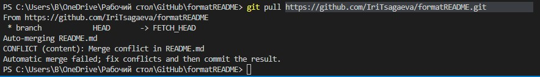

# Инструкция по работе с Git

## Введение 

В данной инструкции мы рассмотрим следующие команды:

* **git config** 
* **git init** 
* **git add** 
* **git status** 
* **git commit** 
* **git log** 
* **git diff** 

## Описание команд:

В книге С. Чакон и Б. Штрауб [Git для профессионального программиста](https://gbcdn.mrgcdn.ru/uploads/asset/4245110/attachment/d4eb8c232f8f2bdf4e42ba7cb49e0c50.pdf) данные команды описываются следующим образом:

1.  > ***Git config***- это инструмент позволяющий получать и устанавливать настройки конфигурации которые задают внешний вид и работу Git. 

    >При установке Git первым делом следует указать имя пользователя и адрес электронной почты. Например:

    

2. > Чтобы начать слежение за существующим проектом, перейдите в папку этого проекта и введите команду ***git init***. В результате в существующей папке появится еще одна папка с именем .git и всеми нужными вам файлами репозитория — это будет основа вашего Git-репозитория. Пока контроль ваших файлов отсутствует.

    
3. > Чтобы начать управление версиями существующих файлов (в противовес пустому каталогу), укажите файлы, за которыми должна следить система, и выполните 
первую фиксацию изменений. Для этого потребуется команда ***git add***, 
добавляющая файлы, за которыми вы хотите следить. Это многоцелевая команда, позволяющая начать слежение за новыми файлами, произвести индексирование файлов, а также пометить файлы с конфликтом слияния как разрешенные. Возможно, целесообразнее воспринимать эту команду как «добавление содержимого к следующему коммиту», а не как «добавление файла к проекту».

    
4. > Основным инструментом определения состояния файлов является команда 
***git status***. 
    
    

    В данном случае команда вернула информацию о том что, добавлены новые файлы, внесены изменения в старые, а так же имеются неотслеживаемые файлы.
    
5. > ***git commit*** - это команда которая фиксирует все внесенные изменения. У этой команды есть параметр -m "ваш текст" в котором можно добавить комментарий к внесенным изменениям.

    

6. > После сохранения нескольких версий файлов или клонирования уже имеющего 
содержимое репозитория вы, скорее всего, захотите взглянуть на то, что было сделано ранее. Базовым и самым мощным инструментом в данном случае является 
команда ***git log***.

    
    
    Команда вывела все commit-ы сделанные с начала отслеживания папки и их индексы.

7. ***git diff*** позволяет получить список отредактированных файлов с внесенными изменениями. Эта команда без дополнительных пораметров позволяет посмотреть что было изменено но пока не проиндексировано. 

    

8. ***git branch <branch_name>*** - команда, позволяющая создавать ветки в репозитории

    
 
 В команду git branch можно добавить параметр -d, после которого указывается название ветки, которую нужно удалить. Например git branch -d branch1

9. ***git merge <branch_name>*** - команда, позволяющая слить текущую ветку и ветку, указанную в параметре.

10. ___git checkout <branch_or_commit_name>___ - команда, позволяющая переключаться между ветками и коммитами. Для перехода на тот или иной коммит, необходимо ввести вместо имени первые 4-5 символов hash-кода коммита.

    

11. ***git clone <url - адрес удаленного репозитория>***- составная команда которая позволяет копировать внешний репозиторий на свой ПК, и пытаеться слить все ветки на локальном компьютере и в удаленном репозитории. 
    
Команда **cd** позволяет перемещаться между папками.
12. ***git fetch [имя удаленного репозитория]*** - эта команда помогает извлечь с удаленного репозитория все пока отсутствующие данные. Их можно просмотреть или слить. В отличии от этой команды ***git pull*** - извлекает отсутствующую информацию и выполняет слияние с текущей веткой.

13. ***git push*** - команда, позволяющая загрузить локальные изменения в удаленный репозиторий.

    

