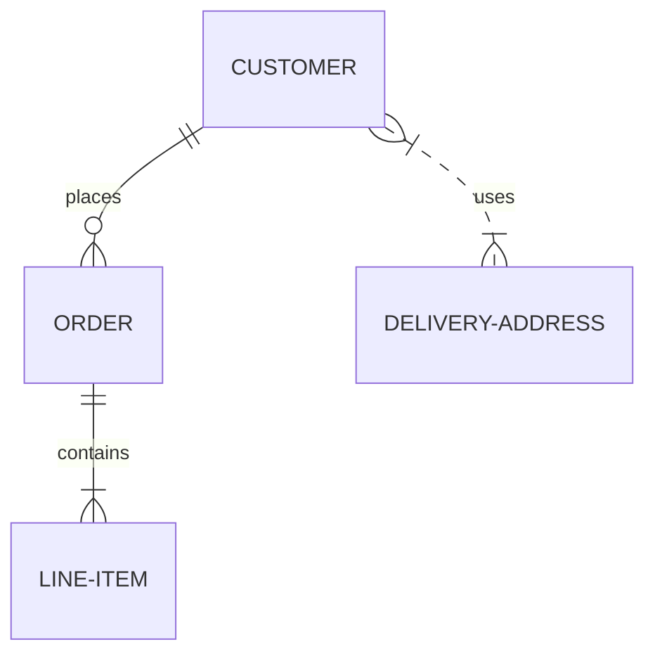

# Изменил код в этом месте, сейчас отправлю pull request, чтобы посмотреть как это работает. #
        
[:arrow_up:Оглавление](#Оглавление) 
____
## Вставка таблиц
```
| LEFT | CENTER | RIGHT |
|----------------|:---------:|----------------:|
| По левому краю | По центру | По правому краю |
| текст | текст | текст |
```
| LEFT | CENTER | RIGHT |
|----------------|:---------:|----------------:|
| По левому краю | По центру | По правому краю |
| текст | текст | текст |

**Внимание:** Если в тексте таблицы нужно использовать символ "вертикальная черта - `|`", то вместо него необходимо написать замену на комбинацию HTML-кода* `&#124;`. Это нужно для того, что бы таблица не потеряла ориентации.    
*) - Можно использовать ASCII и/или UTF коды.

**Пример:**
```
| Обозначение | Описание | Пример регулярного выражения|
|----:|:----:|:----------|
| literal | Строка содержит символьный литерал literal | foo |
| re1&#124;re2 | Строка содержит регулярные выражения `rel` или `re2` | foo&#124;bar |
```
**Результат:**

| Обозначение | Описание | Пример регулярного выражения|
|----:|:----:|:----------|
| literal | Строка содержит символьный литерал literal | foo |
| re1&#124;re2 | Строка содержит регулярные выражения `rel` или `re2` | foo&#124;bar |

[:arrow_up:Оглавление](#Оглавление) 
____
## Диаграмм Mermaid.js
Появилась возможность вставлять диаграммы [Mermaid.js](https://mermaid-js.github.io/mermaid/#/)

<pre>
```mermaid
... код диаграммы ...
```
</pre>
Пример:
<pre>

</pre>

## Параграфы и разрывы строк
Для того, чтобы создать параграф с использованием синтаксиса языка Markdown, достаточно отделить строки текста одной (или более) пустой строкой (пустой считается всякая строка, которая не содержит в себе ничего, кроме пробелов и символов табуляции). Для того, чтобы вставить видимый перенос строки (элемент <br/>) необходимо окончить строку двумя пробелами и нажатием клавиши «Enter». Многие элементы синтаксиса Markdown выглядят и работают гораздо лучше в случае, когда их форматируют с помощью «жесткого перевода строк» (разделение строк, осуществленное самим пользователем, а не программой автоматически). К таким элементам относятся цитаты, списки и пр.
Очень подробно на русском языке о диаграммах Mermaid.js: https://habr.com/ru/post/652867/ 

[:arrow_up:Оглавление](#Оглавление) 
____
## Вставка кода
### Исходный код

В чистом Маркдауне блоки кода отбиваются 4 пробелами в начале каждой строки.

Но в GitHub-Flavored Markdown (сокращенно GFM) есть более удобный способ: ставим по три апострофа (на букве Ё) до и после кода. Также можно указать язык исходного кода.

```html
<nav class="nav nav-primary">
  <ul>
    <li class="tab-conversation active">
      <a href="#" data-role="post-count" class="publisher-nav-color" data-nav="conversation">
        <span class="comment-count">0 комментариев</span>
        <span class="comment-count-placeholder">Комментарии</span>
      </a>
    </li>
    <li class="dropdown user-menu" data-role="logout">
      <a href="#" class="dropdown-toggle" data-toggle="dropdown">
        <span class="dropdown-toggle-wrapper">
          <span>
            Войти
          </span>
        </span>
        <span class="caret"></span>
      </a>
    </li>
  </ul>
</nav>
```

Самое приятное, что в коде не нужно заменять угловые скобки `< >` и амперсанд `&` на их html-сущности.

### Инлайн код

Для вставки кода внутри предложений нужно заключать этот код в апострофы (на букве Ё). Пример: `<html class="ie no-js">`.

Если внутри кода есть апостроф, то код надо обрамить двойными апострофами: ``There is a literal backtick (`) here.``
