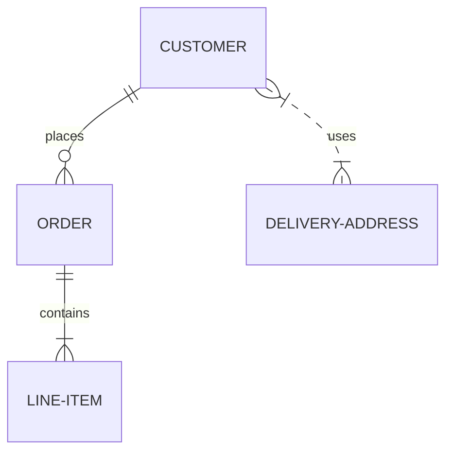

# Описание разметки файла README.md
Для описания проектов на GitHub используется README.md, который пишется на языке разметки markdown. Что и как поддерживается - расписано ниже.

## Оглавление

0. [Разделительная черта](#Разделительная-черта)
1. [Заголовки](#Заголовки)
2. [Работа с выделением текста](#Работа-с-выделением-текста)
3. [Использование эмодзи (emoji)](#Использование-эмодзи-emoji)
4. [Использование цитирования в тексте](#Использование-цитирования-в-тексте)
5. [Подсветка кода](#Подсветка-кода)
6. [Списки](#Списки)
    1. [Маркированный](#Маркированный)
    2. [Нумерованный](#Нумерованный)
    3. [Смешанные списки](#Смешанные-списки)
    4. [Список задач](#Список-задач)
7. [Ссылки](#Ссылки)
8. [Вставка изображения](#Вставка-изображения)
9. [Вставка таблиц](#Вставка-таблиц)
10. [Диаграмм Mermaid.js](#диаграмм-mermaidjs)
11. [Дополнения](https://github.com/GnuriaN/format-README/blob/master/Дополнения.md)
12. [Вставка кода](#Вставка-кода)
    
## Разделительная черта
При использовании
```
____
```
получается разделительная черта
____
[:arrow_up:Оглавление](#Оглавление)
___
## Заголовки

Всего существует шесть уровней заголовков. Для того, чтобы создать заголовок, необходимо в начале строки добавить символы `#`, в количестве равном его уровню.
____
# Заголовок первого уровня
```
# Заголовок 1
```
Заголовок первого уровня также можно создать:
```
Заголовок 1
===========
```
____
## Заголовок второго уровня
```
## Заголовок 2
```
Заголовок второго уровня также можно создать:
```
Заголовок 2
-----------
```
____
### Заголовок третьего уровня
```
### Заголовок 3
```
____
#### Заголовок четвертого уровня
```
#### Заголовок 4
```
____
##### Заголовок пятого уровня
```
##### Заголовок 5
```
____
###### Заголовок шестого уровня
```
###### Заголовок 6
```
____
####### Заголовок седьмого уровня
```
####### Заголовок 7
```
____
[:arrow_up:Оглавление](#Оглавление)
____
## Работа с выделением текста

```
~~Зачеркнутый текст~~
```
~~Зачеркнутый текст (Strikethrough)~~

Для выделения текста **`жирным`** или *`наклонным`* и их сочетания можно использовать комбинации `*` или `_`

```
**Жирный текст (bold)**
```
**Жирный текст (bold)**

```
*Наклонный текст (italic)*
```
*Наклонный текст (italic)*

```
***Жирный наклонный текст (bold italic)***
```
***Жирный наклонный текст (bold italic)***

```
__Жирный текст (bold)__
```
__Жирный текст (bold)__

```
_Наклонный текст (italic)_
```
_Наклонный текст (italic)_

```
___Жирный наклонный текст (bold italic)___
```
___Жирный наклонный текст (bold italic)___

```
~~*__Тут странный текст__*~~
```
~~*__Тут странный текст__*~~
    
[:arrow_up:Оглавление](#Оглавление)
____
## Использование эмодзи (emoji)
В самом тексте можно использовать эмодзи, например, написать вот так:    
:white_check_mark: Это уже сделано    
:negative_squared_cross_mark: Я не буду это делать    
:black_square_button: делать или не делать, вот в чем вопрос?    
В оригинале это выглядит так (в конце строки четыре (4) пробела для того, чтобы был переход на новую строку):
```
:white_check_mark: Это уже сделано    
:negative_squared_cross_mark: Я не буду это делать    
:black_square_button: делать или не делать, вот в чем вопрос?    
```

Список работающих Эмодзи находится тут -> [emoji.md](https://github.com/esimankova/formatREADME/blob/main/emoji.md)    
    
[:arrow_up:Оглавление](#Оглавление)
___
## Использование цитирования в тексте
```
> Цитата (уровень 1)    
> > Вложенная цитата (уровень 2)    
> > > Вложенная цитата (уровень 3)    

> > Продолжение цитаты (уровень 2)    

> Продолжение цитаты (уровень 1)    
```
> Цитата (уровень 1)    
> > Вложенная цитата (уровень 2)    
> > > Вложенная цитата (уровень 3)    

> > Продолжение цитаты (уровень 2)    

> Продолжение цитаты (уровень 1)    

Внешний вид, конечно, не очень, но может и пригодиться.

[:arrow_up:Оглавление](#Оглавление)
___
## Подсветка кода

Если нужно выделить слово или фразу внутри строки, то используются одинарные обратные кавычки (`):

    Это `слово` будет выделено

Для выделения в блоки - тройные:

    ```
        Здесь может быть
        Ваша реклама
    ```

Дополнительно можно задавать язык кода внутри блока, указав его после первых трех кавычек:

    ```html
        <input type="text">
    ```

    ```css
        body {
            margin: 0;
            padding: 0;
        }
    ```

    ```php
        <?php phpinfo();?>
    ```

Пример блока для `C#`:

```C#
using MarkdownSharp;
using MarkdownSharp.Extensions.Mal;

Markdown mark = new Markdown();

// Short link for MAL - 
// http://myanimelist.net/people/413/Kitamura_Eri => mal://Kitamura_Eri
mark.AddExtension(new Articles()); 
mark.AddExtension(new Profile());

mark.Transform(text);
```

Пример блока для `Python`:
```Python
from timeit import Timer

tmp = "Python 3.2.2 (default, Jun 12 2011, 15:08:59) [MSC v.1500 32 bit (Intel)] on win32."

def case1(): # А. инкрементальные конкатенации в цикле
    s = ""
    for i in range(10000):
        s += tmp

def case2(): # Б. через промежуточный список и метод join
    s = []
    for i in range(10000):
        s.append(tmp)
    s = "".join(s)

def case3(): # В. списковое выражение и метод join
    return "".join([tmp for i in range(10000)])

def case4(): # Г. генераторное выражение и метод join
    return "".join(tmp for i in range(10000))

for v in range(1,5):
    print (Timer("func()","from __main__ import case%s as func" % v).timeit(200))
```
    
[:arrow_up:Оглавление](#Оглавление)
___
## Списки

#### Маркированный
Задать **маркированный** список можно несколькими символами `-`, `+` или `*`:
```
- Уровень списка 1. Пункт 1.
- Уровень списка 1. Пункт 2.
- Уровень списка 1. Пункт 3.
```
- Уровень списка 1. Пункт 1.
- Уровень списка 1. Пункт 2.
- Уровень списка 1. Пункт 3.

```
+ Уровень списка 1. Пункт 1.
+ Уровень списка 1. Пункт 2.
+ Уровень списка 1. Пункт 3.
```
+ Уровень списка 1. Пункт 1.
+ Уровень списка 1. Пункт 2.
+ Уровень списка 1. Пункт 3.

```
* Уровень списка 1. Пункт 1.
* Уровень списка 1. Пункт 2.
* Уровень списка 1. Пункт 3.
```
* Уровень списка 1. Пункт 1.
* Уровень списка 1. Пункт 2.
* Уровень списка 1. Пункт 3.

Можно создавать многоуровневые списки. Каждый уровень отделяется **четырьмя** (4) пробелами:
```
- Уровень списка 1. Пункт 1.
    - Уровень списка 2. Пункт 1.
- Уровень списка 1. Пункт 2.
    - Уровень списка 2. Пункт 1.
    - Уровень списка 2. Пункт 2.
- Уровень списка 1. Пункт 3.
    - Уровень списка 2. Пункт 1.
        - Уровень списка 3. Пункт 1.
        - Уровень списка 3. Пункт 2.
           - Уровень списка 4. Пункт 1.
```
- Уровень списка 1. Пункт 1.
  - Уровень списка 2. Пункт 1.
- Уровень списка 1. Пункт 2.
    - Уровень списка 2. Пункт 1.
    - Уровень списка 2. Пункт 2.
- Уровень списка 1. Пункт 3.
    - Уровень списка 2. Пункт 1.
      - Уровень списка 3. Пункт 1.
      - Уровень списка 3. Пункт 2.
         - Уровень списка 4. Пункт 1.

Каждый уровень отделяется двумя пробелами.

#### Нумерованный
Для Githib работа с нумерованными списками выглядит очень интересно. Каждый уровень отделяется **четырьмя** (4) пробелами:
```
1. Первый уровень 1
    1. Второй уровень 1
        1. Третий уровень 1
            1. Четвертый уровень 1
                1. Пятый уровень 1
                    1. Шестой уровень 1
                        1. Седьмой уровень 1
                            1. Восьмой уровень 1
2. Первый уровень 2
2. Первый уровень (должно быть 3)
4. Первый уровень 4
```
1. Первый уровень 1
    1. Второй уровень 1
        1. Третий уровень 1
            1. Четвертый уровень 1
                1. Пятый уровень 1
                    1. Шестой уровень
                        1. Седьмой уровень
                            1. Седьмой уровень
2. Первый уровень 2
2. Первый уровень (должно быть 3)
4. Первый уровень 4

#### Смешанные списки
При использовании смешанных списков нужно очень внимательно следить за нумерацией. Лучше, как и в нумерованных, использовать четыре (4) пробела для отделения уровня.
```
1. Первый уровень "нумерованный" - 1
    * Второй уровень "маркер"
        + Третий уровень "маркер"
        - Третий уровень "маркер"
        1. Третий уровень "нумерованный" - 1
            1. Четвертый уровень "нумерованный" - 1
                1. Пятый уровень "нумерованный" - 1
                    1. Шестой уровень "нумерованный" - 1
                        1. Седьмой уровень "нумерованный" - 1
                        * Седьмой уровень "маркер"
                        2. Седьмой уровень "нумерованный" - 1 (нарушена нумерация, новая нумерация 1)
                        3. Седьмой уровень "нумерованный" - 1 (нарушена нумерация, новая нумерация 2)
                            1. Восьмой уровень "нумерованный" - 1
2. Первый уровень "нумерованный" - 2
- Первый уровень "нумерованный" - 3
4. Первый уровень "нумерованный" - 4 (нарушена нумерация, новая нумерация 1)
5. Первый уровень "нумерованный" - 5 (нарушена нумерация, новая нумерация 2)
```
1. Первый уровень "нумерованный" - 1
    * Второй уровень "маркер"
        + Третий уровень "маркер"
        - Третий уровень "маркер"
        1. Третий уровень "нумерованный" - 1
            1. Четвертый уровень "нумерованный" - 1
                1. Пятый уровень "нумерованный" - 1
                    1. Шестой уровень "нумерованный" - 1
                        1. Седьмой уровень "нумерованный" - 1
                        * Седьмой уровень "маркер"
                        2. Седьмой уровень "нумерованный" - 2
                        3. Седьмой уровень "нумерованный" - 3
                            1. Восьмой уровень "нумерованный" - 1
2. Первый уровень "нумерованный" - 2
- Первый уровень "маркерный" - 3
4. Первый уровень "нумерованный" - 4 (хотя по идее должен быть 3)
5. Первый уровень "нумерованный" - 5 (хотя, по идее должен быть 3)

#### Список задач
(Task List)
Можно создавать "Списки задач". Для этого необходимо использовать `- [ ]` для поставленной задачи и `- [X]` для выполненной задачи.
```
- [X] Придумать внешний вид резюме
- [ ] Написать основные категории
- [X] Опубликовать

```
- [X] Придумать внешний вид резюме
- [ ] Написать основные категории
- [X] Опубликовать

Также можно создавать многоуровневые списки задач. Каждый уровень отделяется **четырьмя** (4) пробелами:
```
- [X] Задача 1
    - [X] Подзадача 1 для Задачи 1
    - [X] Подзадача 2 для Задачи 1
- [ ] Задача 2
    - [X] Подзадача 1 для Задачи 2
    - [ ] Подзадача 2 для Задачи 2
- [ ] Задача 3
    - [ ] Подзадача 1 для Задачи 3
        - [ ] Подзадача 1 для Подзадача 1 для Задачи 3
```
- [X] Задача 1
    - [X] Подзадача 1 для Задачи 1
    - [X] Подзадача 2 для Задачи 1
- [ ] Задача 2
    - [X] Подзадача 1 для Задачи 2
    - [ ] Подзадача 2 для Задачи 2
- [ ] Задача 3
    - [ ] Подзадача 1 для Задачи 3
        - [ ] Подзадача 1 для Подзадача 1 для Задачи 3
    
[:arrow_up:Оглавление](#Оглавление) 
___
## Ссылки
Либо просто вставить ссылку, либо дополнительно задать текст ссылки (пробела между скобками быть не должно):
```
Первый вариант вставки ссылок - это просто написать адрес сайта https://ru.wikipedia.org/wiki/Markdown
```
Первый вариант вставки ссылок - это просто написать адрес сайта https://ru.wikipedia.org/wiki/Markdown

Второй вариант записывается так: `[текст ссылки](адрес ссылки)`
```
[wikipedia.org](https://ru.wikipedia.org/wiki/Markdown)
```
[wikipedia.org](https://ru.wikipedia.org/wiki/Markdown)
    
[wikipedia(DOT)org]:(wikipedia.org)
    
[:arrow_up:Оглавление](#Оглавление)
____
## Вставка изображения
```
 "Markdown logo")
```
 "Markdown logo")

### Дополнительно:
#### Вставка ссылки с картинкой на ролик с YouTube
Описание комбинации `[](ссылка на страничку YouTube)`        
Пример:        
```[](https://youtu.be/SEvR78OhGtw)```        
Что мы увидим:        
[](https://youtu.be/SEvR78OhGtw)        
        
[:arrow_up:Оглавление](#Оглавление) 
____
## Вставка таблиц
```
| LEFT | CENTER | RIGHT |
|----------------|:---------:|----------------:|
| По левому краю | По центру | По правому краю |
| текст | текст | текст |
```
| LEFT | CENTER | RIGHT |
|----------------|:---------:|----------------:|
| По левому краю | По центру | По правому краю |
| текст | текст | текст |

**Внимание:** Если в тексте таблицы нужно использовать символ "вертикальная черта - `|`", то вместо него необходимо написать замену на комбинацию HTML-кода* `&#124;`. Это нужно для того, что бы таблица не потеряла ориентации.    
*) - Можно использовать ASCII и/или UTF коды.

**Пример:**
```
| Обозначение | Описание | Пример регулярного выражения|
|----:|:----:|:----------|
| literal | Строка содержит символьный литерал literal | foo |
| re1&#124;re2 | Строка содержит регулярные выражения `rel` или `re2` | foo&#124;bar |
```
**Результат:**

| Обозначение | Описание | Пример регулярного выражения|
|----:|:----:|:----------|
| literal | Строка содержит символьный литерал literal | foo |
| re1&#124;re2 | Строка содержит регулярные выражения `rel` или `re2` | foo&#124;bar |

[:arrow_up:Оглавление](#Оглавление) 
____
## Диаграмм Mermaid.js
Появилась возможность вставлять диаграммы [Mermaid.js](https://mermaid-js.github.io/mermaid/#/)

<pre>
```mermaid
... код диаграммы ...
```
</pre>
Пример:
<pre>

</pre>

## Параграфы и разрывы строк
Для того, чтобы создать параграф с использованием синтаксиса языка Markdown, достаточно отделить строки текста одной (или более) пустой строкой (пустой считается всякая строка, которая не содержит в себе ничего, кроме пробелов и символов табуляции). Для того, чтобы вставить видимый перенос строки (элемент <br/>) необходимо окончить строку двумя пробелами и нажатием клавиши «Enter». Многие элементы синтаксиса Markdown выглядят и работают гораздо лучше в случае, когда их форматируют с помощью «жесткого перевода строк» (разделение строк, осуществленное самим пользователем, а не программой автоматически). К таким элементам относятся цитаты, списки и пр.
Очень подробно на русском языке о диаграммах Mermaid.js: https://habr.com/ru/post/652867/ 

[:arrow_up:Оглавление](#Оглавление) 
____
## Вставка кода
### Исходный код

В чистом Маркдауне блоки кода отбиваются 4 пробелами в начале каждой строки.

Но в GitHub-Flavored Markdown (сокращенно GFM) есть более удобный способ: ставим по три апострофа (на букве Ё) до и после кода. Также можно указать язык исходного кода.

```html
<nav class="nav nav-primary">
  <ul>
    <li class="tab-conversation active">
      <a href="#" data-role="post-count" class="publisher-nav-color" data-nav="conversation">
        <span class="comment-count">0 комментариев</span>
        <span class="comment-count-placeholder">Комментарии</span>
      </a>
    </li>
    <li class="dropdown user-menu" data-role="logout">
      <a href="#" class="dropdown-toggle" data-toggle="dropdown">
        <span class="dropdown-toggle-wrapper">
          <span>
            Войти
          </span>
        </span>
        <span class="caret"></span>
      </a>
    </li>
  </ul>
</nav>
```

Самое приятное, что в коде не нужно заменять угловые скобки `< >` и амперсанд `&` на их html-сущности.

### Инлайн код

Для вставки кода внутри предложений нужно заключать этот код в апострофы (на букве Ё). Пример: `<html class="ie no-js">`.

Если внутри кода есть апостроф, то код надо обрамить двойными апострофами: ``There is a literal backtick (`) here.``

### Работа с удалёнными репозиториями
Для того, чтобы внести вклад в какой-либо Git-проект, вам необходимо уметь работать с удалёнными репозиториями. Удалённые репозитории представляют собой версии вашего проекта, сохранённые в интернете или ещё где-то в сети. У вас может быть несколько удалённых репозиториев, каждый из которых может быть доступен для чтения или для чтения-записи. Взаимодействие с другими пользователями предполагает управление удалёнными репозиториями, а также отправку и получение данных из них. Управление репозиториями включает в себя как умение добавлять новые, так и умение удалять устаревшие репозитории, а также умение управлять различными удалёнными ветками, объявлять их отслеживаемыми или нет и так далее. В данном разделе мы рассмотрим некоторые из этих навыков.

Примечание
Удаленный репозиторий может находиться на вашем локальном компьютере.
Вполне возможно, что удалённый репозиторий будет находиться на том же компьютере, на котором работаете вы. Слово «удалённый» не означает, что репозиторий обязательно должен быть где-то в сети или Интернет, а значит только — где-то ещё. Работа с таким удалённым репозиторием подразумевает выполнение стандартных операций отправки и получения, как и с любым другим удалённым репозиторием.

Просмотр удалённых репозиториев
Для того, чтобы просмотреть список настроенных удалённых репозиториев, вы можете запустить команду git remote. Она выведет названия доступных удалённых репозиториев. Если вы клонировали репозиторий, то увидите как минимум origin — имя по умолчанию, которое Git даёт серверу, с которого производилось клонирование:

$ git clone https://github.com/schacon/ticgit
Cloning into 'ticgit'...
remote: Reusing existing pack: 1857, done.
remote: Total 1857 (delta 0), reused 0 (delta 0)
Receiving objects: 100% (1857/1857), 374.35 KiB | 268.00 KiB/s, done.
Resolving deltas: 100% (772/772), done.
Checking connectivity... done.
$ cd ticgit
$ git remote
origin
Вы можете также указать ключ -v, чтобы просмотреть адреса для чтения и записи, привязанные к репозиторию:

$ git remote -v
origin	https://github.com/schacon/ticgit (fetch)
origin	https://github.com/schacon/ticgit (push)
Если у вас больше одного удалённого репозитория, команда выведет их все. Например, для репозитория с несколькими настроенными удалёнными репозиториями в случае совместной работы нескольких пользователей, вывод команды может выглядеть примерно так:

$ cd grit
$ git remote -v
bakkdoor  https://github.com/bakkdoor/grit (fetch)
bakkdoor  https://github.com/bakkdoor/grit (push)
cho45     https://github.com/cho45/grit (fetch)
cho45     https://github.com/cho45/grit (push)
defunkt   https://github.com/defunkt/grit (fetch)
defunkt   https://github.com/defunkt/grit (push)
koke      git://github.com/koke/grit.git (fetch)
koke      git://github.com/koke/grit.git (push)
origin    git@github.com:mojombo/grit.git (fetch)
origin    git@github.com:mojombo/grit.git (push)
Это означает, что мы можем легко получить изменения от любого из этих пользователей. Возможно, что некоторые из репозиториев доступны для записи и в них можно отправлять свои изменения, хотя вывод команды не даёт никакой информации о правах доступа.

Обратите внимание на разнообразие протоколов, используемых при указании адреса удалённого репозитория; подробнее мы рассмотрим протоколы в разделе Установка Git на сервер главы 4.

Добавление удалённых репозиториев
В предыдущих разделах мы уже упоминали и приводили примеры добавления удалённых репозиториев, сейчас рассмотрим эту операцию подробнее. Для того, чтобы добавить удалённый репозиторий и присвоить ему имя (shortname), просто выполните команду git remote add <shortname> <url>:

$ git remote
origin
$ git remote add pb https://github.com/paulboone/ticgit
$ git remote -v
origin	https://github.com/schacon/ticgit (fetch)
origin	https://github.com/schacon/ticgit (push)
pb	https://github.com/paulboone/ticgit (fetch)
pb	https://github.com/paulboone/ticgit (push)
Теперь вместо указания полного пути вы можете использовать pb. Например, если вы хотите получить изменения, которые есть у Пола, но нету у вас, вы можете выполнить команду git fetch pb:

$ git fetch pb
remote: Counting objects: 43, done.
remote: Compressing objects: 100% (36/36), done.
remote: Total 43 (delta 10), reused 31 (delta 5)
Unpacking objects: 100% (43/43), done.
From https://github.com/paulboone/ticgit
 * [new branch]      master     -> pb/master
 * [new branch]      ticgit     -> pb/ticgit
Ветка master из репозитория Пола сейчас доступна вам под именем pb/master. Вы можете слить её с одной из ваших веток или переключить на неё локальную ветку, чтобы просмотреть содержимое ветки Пола. Более подробно работа с ветками рассмотрена в главе Ветвление в Git.

Получение изменений из удалённого репозитория — Fetch и Pull
Как вы только что узнали, для получения данных из удалённых проектов, следует выполнить:

$ git fetch [remote-name]
Данная команда связывается с указанным удалённым проектом и забирает все те данные проекта, которых у вас ещё нет. После того как вы выполнили команду, у вас должны появиться ссылки на все ветки из этого удалённого проекта, которые вы можете просмотреть или слить в любой момент.

Когда вы клонируете репозиторий, команда clone автоматически добавляет этот удалённый репозиторий под именем «origin». Таким образом, git fetch origin извлекает все наработки, отправленные на этот сервер после того, как вы его клонировали (или получили изменения с помощью fetch). Важно отметить, что команда git fetch забирает данные в ваш локальный репозиторий, но не сливает их с какими-либо вашими наработками и не модифицирует то, над чем вы работаете в данный момент. Вам необходимо вручную слить эти данные с вашими, когда вы будете готовы.

Если ветка настроена на отслеживание удалённой ветки (см. следующий раздел и главу Ветвление в Git чтобы получить больше информации), то вы можете использовать команду git pull чтобы автоматически получить изменения из удалённой ветки и слить их со своей текущей. Этот способ может для вас оказаться более простым или более удобным. К тому же, по умолчанию команда git clone автоматически настраивает вашу локальную ветку master на отслеживание удалённой ветки master на сервере, с которого вы клонировали репозиторий. Название веток может быть другим и зависит от ветки по умолчанию на сервере. Выполнение git pull, как правило, извлекает (fetch) данные с сервера, с которого вы изначально клонировали, и автоматически пытается слить (merge) их с кодом, над которым вы в данный момент работаете.

Примечание
Начиная с версии 2.27, команда git pull выдаёт предупреждение, если настройка pull.rebase не установлена. Git будет выводить это предупреждение каждый раз пока настройка не будет установлена.

Если хотите использовать поведение Git по умолчанию (простое смещение вперёд если возможно — иначе создание коммита слияния): git config --global pull.rebase "false"

Если хотите использовать перебазирование при получении изменений: git config --global pull.rebase "true"

Отправка изменений в удаленный репозиторий (Push)
Когда вы хотите поделиться своими наработками, вам необходимо отправить их в удалённый репозиторий. Команда для этого действия простая: git push <remote-name> <branch-name>. Чтобы отправить вашу ветку master на сервер origin (повторимся, что клонирование обычно настраивает оба этих имени автоматически), вы можете выполнить следующую команду для отправки ваших коммитов:

$ git push origin master
Эта команда срабатывает только в случае, если вы клонировали с сервера, на котором у вас есть права на запись, и если никто другой с тех пор не выполнял команду push. Если вы и кто-то ещё одновременно клонируете, затем он выполняет команду push, а после него выполнить команду push попытаетесь вы, то ваш push точно будет отклонён. Вам придётся сначала получить изменения и объединить их с вашими и только после этого вам будет позволено выполнить push. Обратитесь к главе Ветвление в Git для более подробного описания, как отправлять изменения на удалённый сервер.

Просмотр удаленного репозитория
Если хотите получить побольше информации об одном из удалённых репозиториев, вы можете использовать команду git remote show <remote>. Выполнив эту команду с некоторым именем, например, origin, вы получите следующий результат:

$ git remote show origin
* remote origin
  Fetch URL: https://github.com/schacon/ticgit
  Push  URL: https://github.com/schacon/ticgit
  HEAD branch: master
  Remote branches:
    master                               tracked
    dev-branch                           tracked
  Local branch configured for 'git pull':
    master merges with remote master
  Local ref configured for 'git push':
    master pushes to master (up to date)
Она выдаёт URL удалённого репозитория, а также информацию об отслеживаемых ветках. Эта команда любезно сообщает вам, что если вы, находясь на ветке master, выполните git pull, ветка master с удалённого сервера будет автоматически влита в вашу сразу после получения всех необходимых данных. Она также выдаёт список всех полученных ею ссылок.

Это был пример для простой ситуации и вы наверняка встречались с чем-то подобным. Однако, если вы используете Git более интенсивно, вы можете увидеть гораздо большее количество информации от git remote show:

$ git remote show origin
* remote origin
  URL: https://github.com/my-org/complex-project
  Fetch URL: https://github.com/my-org/complex-project
  Push  URL: https://github.com/my-org/complex-project
  HEAD branch: master
  Remote branches:
    master                           tracked
    dev-branch                       tracked
    markdown-strip                   tracked
    issue-43                         new (next fetch will store in remotes/origin)
    issue-45                         new (next fetch will store in remotes/origin)
    refs/remotes/origin/issue-11     stale (use 'git remote prune' to remove)
  Local branches configured for 'git pull':
    dev-branch merges with remote dev-branch
    master     merges with remote master
  Local refs configured for 'git push':
    dev-branch                     pushes to dev-branch                     (up to date)
    markdown-strip                 pushes to markdown-strip                 (up to date)
    master                         pushes to master                         (up to date)
Данная команда показывает какая именно локальная ветка будет отправлена на удалённый сервер по умолчанию при выполнении git push. Она также показывает, каких веток с удалённого сервера у вас ещё нет, какие ветки всё ещё есть у вас, но уже удалены на сервере, и для нескольких веток показано, какие удалённые ветки будут в них влиты при выполнении git pull.

Удаление и переименование удалённых репозиториев
Для переименования удалённого репозитория можно выполнить git remote rename. Например, если вы хотите переименовать pb в paul, вы можете это сделать при помощи git remote rename:

$ git remote rename pb paul
$ git remote
origin
paul
Стоит упомянуть, что это также изменит имена удалённых веток в вашем репозитории. То, к чему вы обращались как pb/master, теперь стало paul/master.

Если по какой-то причине вы хотите удалить удаленный репозиторий — вы сменили сервер или больше не используете определённое зеркало, или кто-то перестал вносить изменения — вы можете использовать git remote rm:

$ git remote remove paul
$ git remote
origin
При удалении ссылки на удалённый репозиторий все отслеживаемые ветки и настройки, связанные с этим репозиторием, так же будут удалены.
