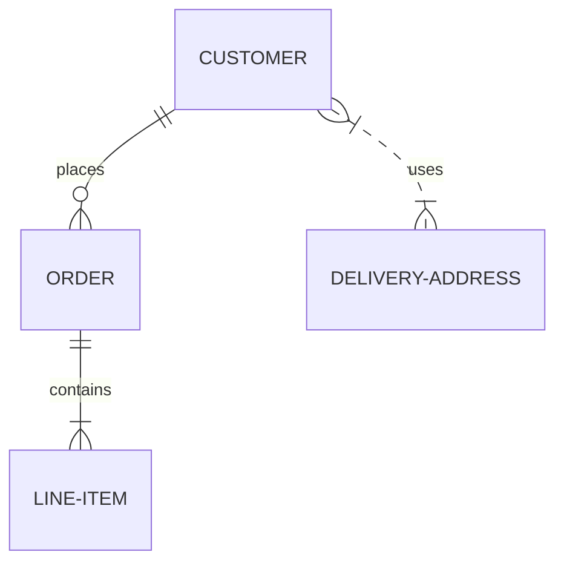

# Описание разметки файла README.md
Для описания проектов на GitHub используется README.md, который пишется на языке разметки markdown. Что и как поддерживается - расписано ниже.

## Оглавление

0. [Разделительная черта](#Разделительная-черта)
1. [Заголовки](#Заголовки)
2. [Работа с выделением текста](#Работа-с-выделением-текста)
3. [Использование эмодзи (emoji)](#Использование-эмодзи-emoji)
4. [Использование цитирования в тексте](#Использование-цитирования-в-тексте)
5. [Подсветка кода](#Подсветка-кода)
6. [Списки](#Списки)
    1. [Маркированный](#Маркированный)
    2. [Нумерованный](#Нумерованный)
    3. [Смешанные списки](#Смешанные-списки)
    4. [Список задач](#Список-задач)
7. [Ссылки](#Ссылки)
8. [Вставка изображения](#Вставка-изображения)
9. [Вставка таблиц](#Вставка-таблиц)
10. [Диаграмм Mermaid.js](#диаграмм-mermaidjs)
11. [Дополнения](https://github.com/GnuriaN/format-README/blob/master/Дополнения.md)
12. [Вставка кода](#Вставка-кода)
    
## Разделительная черта
При использовании
```
____
```
получается разделительная черта
____
[:arrow_up:Оглавление](#Оглавление)
___
## Заголовки

Всего существует шесть уровней заголовков. Для того, чтобы создать заголовок, необходимо в начале строки добавить символы `#`, в количестве равном его уровню.
____
# Заголовок первого уровня
```
# Заголовок 1
```
Заголовок первого уровня также можно создать:
```
Заголовок 1
===========
```
____
## Заголовок второго уровня
```
## Заголовок 2
```
Заголовок второго уровня также можно создать:
```
Заголовок 2
-----------
```
____
### Заголовок третьего уровня
```
### Заголовок 3
```
____
#### Заголовок четвертого уровня
```
#### Заголовок 4
```
____
##### Заголовок пятого уровня
```
##### Заголовок 5
```
____
###### Заголовок шестого уровня
```
###### Заголовок 6
```
____
####### Заголовок седьмого уровня
```
####### Заголовок 7
```
____
[:arrow_up:Оглавление](#Оглавление)
____
## Работа с выделением текста

```
~~Зачеркнутый текст~~
```
~~Зачеркнутый текст (Strikethrough)~~

Для выделения текста **`жирным`** или *`наклонным`* и их сочетания можно использовать комбинации `*` или `_`

```
**Жирный текст (bold)**
```
**Жирный текст (bold)**

```
*Наклонный текст (italic)*
```
*Наклонный текст (italic)*

```
***Жирный наклонный текст (bold italic)***
```
***Жирный наклонный текст (bold italic)***

```
__Жирный текст (bold)__
```
__Жирный текст (bold)__

```
_Наклонный текст (italic)_
```
_Наклонный текст (italic)_

```
___Жирный наклонный текст (bold italic)___
```
___Жирный наклонный текст (bold italic)___

```
~~*__Тут странный текст__*~~
```
~~*__Тут странный текст__*~~
    
[:arrow_up:Оглавление](#Оглавление)
____
## Использование эмодзи (emoji)
В самом тексте можно использовать эмодзи, например, написать вот так:    
:white_check_mark: Это уже сделано    
:negative_squared_cross_mark: Я не буду это делать    
:black_square_button: делать или не делать, вот в чем вопрос?    
В оригинале это выглядит так (в конце строки четыре (4) пробела для того, чтобы был переход на новую строку):
```
:white_check_mark: Это уже сделано    
:negative_squared_cross_mark: Я не буду это делать    
:black_square_button: делать или не делать, вот в чем вопрос?    
```

Список работающих Эмодзи находится тут -> [emoji.md](https://github.com/esimankova/formatREADME/blob/main/emoji.md)    
    
[:arrow_up:Оглавление](#Оглавление)
___
## Использование цитирования в тексте
```
> Цитата (уровень 1)    
> > Вложенная цитата (уровень 2)    
> > > Вложенная цитата (уровень 3)    

> > Продолжение цитаты (уровень 2)    

> Продолжение цитаты (уровень 1)    
```
> Цитата (уровень 1)    
> > Вложенная цитата (уровень 2)    
> > > Вложенная цитата (уровень 3)    

> > Продолжение цитаты (уровень 2)    

> Продолжение цитаты (уровень 1)    

Внешний вид, конечно, не очень, но может и пригодиться.

[:arrow_up:Оглавление](#Оглавление)
___
## Подсветка кода

Если нужно выделить слово или фразу внутри строки, то используются одинарные обратные кавычки (`):

    Это `слово` будет выделено

Для выделения в блоки - тройные:

    ```
        Здесь может быть
        Ваша реклама
    ```

Дополнительно можно задавать язык кода внутри блока, указав его после первых трех кавычек:

    ```html
        <input type="text">
    ```

    ```css
        body {
            margin: 0;
            padding: 0;
        }
    ```

    ```php
        <?php phpinfo();?>
    ```

Пример блока для `C#`:

```C#
using MarkdownSharp;
using MarkdownSharp.Extensions.Mal;

Markdown mark = new Markdown();

// Short link for MAL - 
// http://myanimelist.net/people/413/Kitamura_Eri => mal://Kitamura_Eri
mark.AddExtension(new Articles()); 
mark.AddExtension(new Profile());

mark.Transform(text);
```

Пример блока для `Python`:
```Python
from timeit import Timer

tmp = "Python 3.2.2 (default, Jun 12 2011, 15:08:59) [MSC v.1500 32 bit (Intel)] on win32."

def case1(): # А. инкрементальные конкатенации в цикле
    s = ""
    for i in range(10000):
        s += tmp

def case2(): # Б. через промежуточный список и метод join
    s = []
    for i in range(10000):
        s.append(tmp)
    s = "".join(s)

def case3(): # В. списковое выражение и метод join
    return "".join([tmp for i in range(10000)])

def case4(): # Г. генераторное выражение и метод join
    return "".join(tmp for i in range(10000))

for v in range(1,5):
    print (Timer("func()","from __main__ import case%s as func" % v).timeit(200))
```
    
[:arrow_up:Оглавление](#Оглавление)
___
## Списки

#### Маркированный
Задать **маркированный** список можно несколькими символами `-`, `+` или `*`:
```
- Уровень списка 1. Пункт 1.
- Уровень списка 1. Пункт 2.
- Уровень списка 1. Пункт 3.
```
- Уровень списка 1. Пункт 1.
- Уровень списка 1. Пункт 2.
- Уровень списка 1. Пункт 3.

```
+ Уровень списка 1. Пункт 1.
+ Уровень списка 1. Пункт 2.
+ Уровень списка 1. Пункт 3.
```
+ Уровень списка 1. Пункт 1.
+ Уровень списка 1. Пункт 2.
+ Уровень списка 1. Пункт 3.

```
* Уровень списка 1. Пункт 1.
* Уровень списка 1. Пункт 2.
* Уровень списка 1. Пункт 3.
```
* Уровень списка 1. Пункт 1.
* Уровень списка 1. Пункт 2.
* Уровень списка 1. Пункт 3.

Можно создавать многоуровневые списки. Каждый уровень отделяется **четырьмя** (4) пробелами:
```
- Уровень списка 1. Пункт 1.
    - Уровень списка 2. Пункт 1.
- Уровень списка 1. Пункт 2.
    - Уровень списка 2. Пункт 1.
    - Уровень списка 2. Пункт 2.
- Уровень списка 1. Пункт 3.
    - Уровень списка 2. Пункт 1.
        - Уровень списка 3. Пункт 1.
        - Уровень списка 3. Пункт 2.
           - Уровень списка 4. Пункт 1.
```
- Уровень списка 1. Пункт 1.
  - Уровень списка 2. Пункт 1.
- Уровень списка 1. Пункт 2.
    - Уровень списка 2. Пункт 1.
    - Уровень списка 2. Пункт 2.
- Уровень списка 1. Пункт 3.
    - Уровень списка 2. Пункт 1.
      - Уровень списка 3. Пункт 1.
      - Уровень списка 3. Пункт 2.
         - Уровень списка 4. Пункт 1.

Каждый уровень отделяется двумя пробелами.

#### Нумерованный
Для Githib работа с нумерованными списками выглядит очень интересно. Каждый уровень отделяется **четырьмя** (4) пробелами:
```
1. Первый уровень 1
    1. Второй уровень 1
        1. Третий уровень 1
            1. Четвертый уровень 1
                1. Пятый уровень 1
                    1. Шестой уровень 1
                        1. Седьмой уровень 1
                            1. Восьмой уровень 1
2. Первый уровень 2
2. Первый уровень (должно быть 3)
4. Первый уровень 4
```
1. Первый уровень 1
    1. Второй уровень 1
        1. Третий уровень 1
            1. Четвертый уровень 1
                1. Пятый уровень 1
                    1. Шестой уровень
                        1. Седьмой уровень
                            1. Седьмой уровень
2. Первый уровень 2
2. Первый уровень (должно быть 3)
4. Первый уровень 4

#### Смешанные списки
При использовании смешанных списков нужно очень внимательно следить за нумерацией. Лучше, как и в нумерованных, использовать четыре (4) пробела для отделения уровня.
```
1. Первый уровень "нумерованный" - 1
    * Второй уровень "маркер"
        + Третий уровень "маркер"
        - Третий уровень "маркер"
        1. Третий уровень "нумерованный" - 1
            1. Четвертый уровень "нумерованный" - 1
                1. Пятый уровень "нумерованный" - 1
                    1. Шестой уровень "нумерованный" - 1
                        1. Седьмой уровень "нумерованный" - 1
                        * Седьмой уровень "маркер"
                        2. Седьмой уровень "нумерованный" - 1 (нарушена нумерация, новая нумерация 1)
                        3. Седьмой уровень "нумерованный" - 1 (нарушена нумерация, новая нумерация 2)
                            1. Восьмой уровень "нумерованный" - 1
2. Первый уровень "нумерованный" - 2
- Первый уровень "нумерованный" - 3
4. Первый уровень "нумерованный" - 4 (нарушена нумерация, новая нумерация 1)
5. Первый уровень "нумерованный" - 5 (нарушена нумерация, новая нумерация 2)
```
1. Первый уровень "нумерованный" - 1
    * Второй уровень "маркер"
        + Третий уровень "маркер"
        - Третий уровень "маркер"
        1. Третий уровень "нумерованный" - 1
            1. Четвертый уровень "нумерованный" - 1
                1. Пятый уровень "нумерованный" - 1
                    1. Шестой уровень "нумерованный" - 1
                        1. Седьмой уровень "нумерованный" - 1
                        * Седьмой уровень "маркер"
                        2. Седьмой уровень "нумерованный" - 2
                        3. Седьмой уровень "нумерованный" - 3
                            1. Восьмой уровень "нумерованный" - 1
2. Первый уровень "нумерованный" - 2
- Первый уровень "маркерный" - 3
4. Первый уровень "нумерованный" - 4 (хотя по идее должен быть 3)
5. Первый уровень "нумерованный" - 5 (хотя, по идее должен быть 3)

#### Список задач
(Task List)
Можно создавать "Списки задач". Для этого необходимо использовать `- [ ]` для поставленной задачи и `- [X]` для выполненной задачи.
```
- [X] Придумать внешний вид резюме
- [ ] Написать основные категории
- [X] Опубликовать

```
- [X] Придумать внешний вид резюме
- [ ] Написать основные категории
- [X] Опубликовать

Также можно создавать многоуровневые списки задач. Каждый уровень отделяется **четырьмя** (4) пробелами:
```
- [X] Задача 1
    - [X] Подзадача 1 для Задачи 1
    - [X] Подзадача 2 для Задачи 1
- [ ] Задача 2
    - [X] Подзадача 1 для Задачи 2
    - [ ] Подзадача 2 для Задачи 2
- [ ] Задача 3
    - [ ] Подзадача 1 для Задачи 3
        - [ ] Подзадача 1 для Подзадача 1 для Задачи 3
```
- [X] Задача 1
    - [X] Подзадача 1 для Задачи 1
    - [X] Подзадача 2 для Задачи 1
- [ ] Задача 2
    - [X] Подзадача 1 для Задачи 2
    - [ ] Подзадача 2 для Задачи 2
- [ ] Задача 3
    - [ ] Подзадача 1 для Задачи 3
        - [ ] Подзадача 1 для Подзадача 1 для Задачи 3
    
[:arrow_up:Оглавление](#Оглавление) 
___
## Ссылки
Либо просто вставить ссылку, либо дополнительно задать текст ссылки (пробела между скобками быть не должно):
```
Первый вариант вставки ссылок - это просто написать адрес сайта https://ru.wikipedia.org/wiki/Markdown
```
Первый вариант вставки ссылок - это просто написать адрес сайта https://ru.wikipedia.org/wiki/Markdown

Второй вариант записывается так: `[текст ссылки](адрес ссылки)`
```
[wikipedia.org](https://ru.wikipedia.org/wiki/Markdown)
```
[wikipedia.org](https://ru.wikipedia.org/wiki/Markdown)
    
[wikipedia(DOT)org]:(wikipedia.org)
    
[:arrow_up:Оглавление](#Оглавление)
____
## Вставка изображения
```
 "Markdown logo")
```
 "Markdown logo")

### Дополнительно:
#### Вставка ссылки с картинкой на ролик с YouTube
Описание комбинации `[](ссылка на страничку YouTube)`        
Пример:        
```[](https://youtu.be/SEvR78OhGtw)```        
Что мы увидим:        
[](https://youtu.be/SEvR78OhGtw)        
        
[:arrow_up:Оглавление](#Оглавление) 
____
## Вставка таблиц
```
| LEFT | CENTER | RIGHT |
|----------------|:---------:|----------------:|
| По левому краю | По центру | По правому краю |
| текст | текст | текст |
```
| LEFT | CENTER | RIGHT |
|----------------|:---------:|----------------:|
| По левому краю | По центру | По правому краю |
| текст | текст | текст |

**Внимание:** Если в тексте таблицы нужно использовать символ "вертикальная черта - `|`", то вместо него необходимо написать замену на комбинацию HTML-кода* `&#124;`. Это нужно для того, что бы таблица не потеряла ориентации.    
*) - Можно использовать ASCII и/или UTF коды.

**Пример:**
```
| Обозначение | Описание | Пример регулярного выражения|
|----:|:----:|:----------|
| literal | Строка содержит символьный литерал literal | foo |
| re1&#124;re2 | Строка содержит регулярные выражения `rel` или `re2` | foo&#124;bar |
```
**Результат:**

| Обозначение | Описание | Пример регулярного выражения|
|----:|:----:|:----------|
| literal | Строка содержит символьный литерал literal | foo |
| re1&#124;re2 | Строка содержит регулярные выражения `rel` или `re2` | foo&#124;bar |

[:arrow_up:Оглавление](#Оглавление) 
____
## Диаграмм Mermaid.js
Появилась возможность вставлять диаграммы [Mermaid.js](https://mermaid-js.github.io/mermaid/#/)

<pre>
```mermaid
... код диаграммы ...
```
</pre>
Пример:
<pre>

</pre>

## Параграфы и разрывы строк
Для того, чтобы создать параграф с использованием синтаксиса языка Markdown, достаточно отделить строки текста одной (или более) пустой строкой (пустой считается всякая строка, которая не содержит в себе ничего, кроме пробелов и символов табуляции). Для того, чтобы вставить видимый перенос строки (элемент <br/>) необходимо окончить строку двумя пробелами и нажатием клавиши «Enter». Многие элементы синтаксиса Markdown выглядят и работают гораздо лучше в случае, когда их форматируют с помощью «жесткого перевода строк» (разделение строк, осуществленное самим пользователем, а не программой автоматически). К таким элементам относятся цитаты, списки и пр.
Очень подробно на русском языке о диаграммах Mermaid.js: https://habr.com/ru/post/652867/ 

[:arrow_up:Оглавление](#Оглавление) 
____
## Вставка кода
### Исходный код

В чистом Маркдауне блоки кода отбиваются 4 пробелами в начале каждой строки.

Но в GitHub-Flavored Markdown (сокращенно GFM) есть более удобный способ: ставим по три апострофа (на букве Ё) до и после кода. Также можно указать язык исходного кода.

```html
<nav class="nav nav-primary">
  <ul>
    <li class="tab-conversation active">
      <a href="#" data-role="post-count" class="publisher-nav-color" data-nav="conversation">
        <span class="comment-count">0 комментариев</span>
        <span class="comment-count-placeholder">Комментарии</span>
      </a>
    </li>
    <li class="dropdown user-menu" data-role="logout">
      <a href="#" class="dropdown-toggle" data-toggle="dropdown">
        <span class="dropdown-toggle-wrapper">
          <span>
            Войти
          </span>
        </span>
        <span class="caret"></span>
      </a>
    </li>
  </ul>
</nav>
```

Самое приятное, что в коде не нужно заменять угловые скобки `< >` и амперсанд `&` на их html-сущности.

### Инлайн код

Для вставки кода внутри предложений нужно заключать этот код в апострофы (на букве Ё). Пример: `<html class="ie no-js">`.

Если внутри кода есть апостроф, то код надо обрамить двойными апострофами: ``There is a literal backtick (`) here.``


# Инструкция по работе с git


## Настройка и конфигурация

Две довольно распространённые команды, используемые как сразу после установки Git, так и в повседневной практике для настройки и получения помощи — это *config* и *help*.
* **git config** - включает в себя целый ряд настроек, в том числе для указания имени, адреса электронной почты и редактора.
* **git help** - Команда git help служит для отображения встроенной документации Git о других командах.

## Клонирование и создание репозиториев

Существует два способа создать Git репозиторий. Первый — клонировать его из существующего репозитория (например, по сети); второй — создать репозиторий в существующем каталоге.
* **git init** – позволяет превратить обычный каталог в Git репозиторий и начать версионировать файлы в нём
* **git clone** - создаёт новый каталог, переходит внутрь и выполняет git init для создания пустого репозитория, затем она добавляет новый удалённый репозиторий (git remote add) для указанного URL (по умолчанию он получит имя origin), выполняет git fetch для этого репозитория и, наконец, извлекает последний коммит в ваш рабочий каталог, используя git checkout.

## Основные команды

* **git add** - Команда git add добавляет содержимое рабочего каталога в индекс (staging area) для последующего коммита.
* **git status** - показывает состояния файлов в рабочем каталоге и индексе: какие файлы изменены, но не добавлены в индекс; какие ожидают коммита в индексе.
* **git diff** - используется для вычисления разницы между любыми двумя Git деревьями.
* **git commit** – сохраняет данные, добавленные в индекс с помощью git add

## Ветвление и слияния

За создание новых веток и слияние их воедино отвечает несколько Git команд.
* **git branch** – перечисляет созданные ветки, создает новые, удаляет и переименовывает их.
* **git checkout** - используется для переключения веток и выгрузки их содержимого в рабочий каталог.
* **git merge** - используется для слияния одной или нескольких веток в текущую
* **git log** - используется для просмотра истории коммитов, начиная с самого свежего и уходя к истокам проекта

# Инструкция по работе с удаленным репозиторием

1. Создать аккаунт на [github.com](github.com)
2. Создать локальный репозиторий
3. "Подружить" локальный и удаленный репозитории. Github при создании нового репозитория подскажет как это сделать=)
4. Отправить (push) локальный репозиторий в удаленный, при этом, возможно, нужно будет авторизоваться на удаленном репозитории
5. Провести изменения с другого компьютера
6. Выкачать (pull) актуальное состояние из удаленного репозитория.

## Для работы с открытыми (чужими) репозиториями

1.	Делаем форк (fork) интересующего нас репозитория
2.	Делаем клон (git clone) для нашей версии репозитория
3.	Создаем ветку с предлагаемыми изменениями
4.	Производим все изменения только в этой ветке
5.	Отправляем эти изменения на свой аккунт (push)
6.	В окне github появляется возможность отправить pull request
