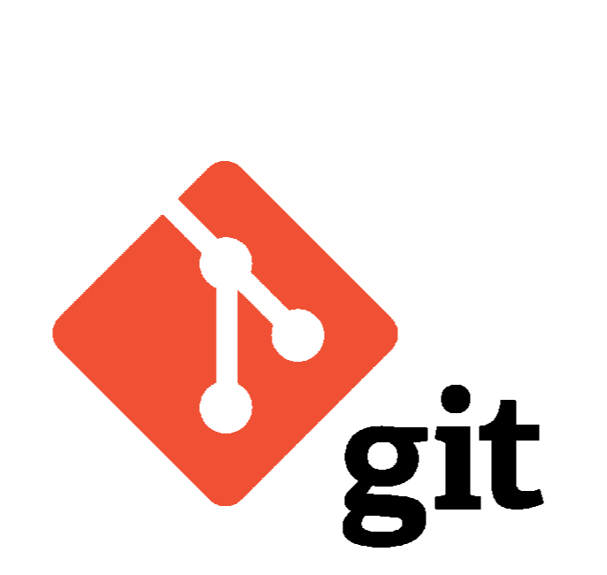

# Краткий справочник по Git

## Основные команды Git

1. **git init** - инициализация локального репозитория

2. **git status** - получить информацию от git о его текущем состоянии

3. **git add** - добавить файл или файлы к следующему коммиту

4. **git commit  -m "message"** - создание коммита

5. **git log** - вывод на экран истории всех коммитов с их хеш-кодами

6. **git checkout** - переход от одного коммита к другому

7. **git checkout master** - вернуться к актуальному состоянию и продолжить работу

8. **git diff** -увидеть разницу между текущим файлом и закомиченным файлом

## Ветки в GIT
При работе над проектами часто возникает ситуация при 
которой существует несколько вариантов проекта. Например, один вариант – это текущая версия проекта, другой вариант – это версия, в которую внесены экспериментальные или логически не завершенные элементы. Особенно часто возникают различные варианты проекта при работе над ним нескольких разработчиков.

В СКВ различные варианты проекта хранятся в различных ветках (branch).
При создании проекта существует только одна ветка (один вариант проекта), которая называется master. Эта ветка в течении всего проекта является основной. На ее основе могут создавать другие ветки, которые с помощью новых коммитов будут представлять другие варианты проекта.
Ветки проекта могут объединяться (сливаться). Например, после логического завершения какой-либо части проекта, выполняемой в отдельной ветке, ветка этой части сливается с веткой master.

В СКВ git для организации работы с ветками каждый коммит хранит указатель на предыдущий коммит. Благодаря этому для каждой ветки достаточно хранить только указатель на последний коммит в этой ветке. Указатель на ветку имеет то же имя, что и ветка, и в этом смысле указатель и саму ветку можно считать синонимами.

Помимо указателей на ветку в git существует еще указатель HEAD на текущий коммит (ветку). В случае, если используется одна ветка, указатели HEAD и master совпадают. Если в репозитории имеется несколько веток, то ветка, на которую указывает указатель HEAD называется текущей.

При выполнении команды git commit создается новый коммит, после чего на него перемещаются указатели HEAD и текущей ветки.

### Команды для работы с ветками и указателями

Для создания новой ветки используется команда

git branch имя_ветки

Для просмотра имеющихся в репозитории веток нужно ввести эту команду без аргументов:

git branch

Эта команда только создает ветку, но не изменяет указатель на текущую ветку HEAD. Для того, чтобы сделать ветку текущей (переместить HEAD) нужно выполнить команду

git checkout имя_ветки

Создать ветку и сразу на нее переключиться можно с помощью команды

git checkout -b имя_ветки

[Сайт https://daringfireball.net/projects/markdown/](https://daringfireball.net/projects/markdown/)
